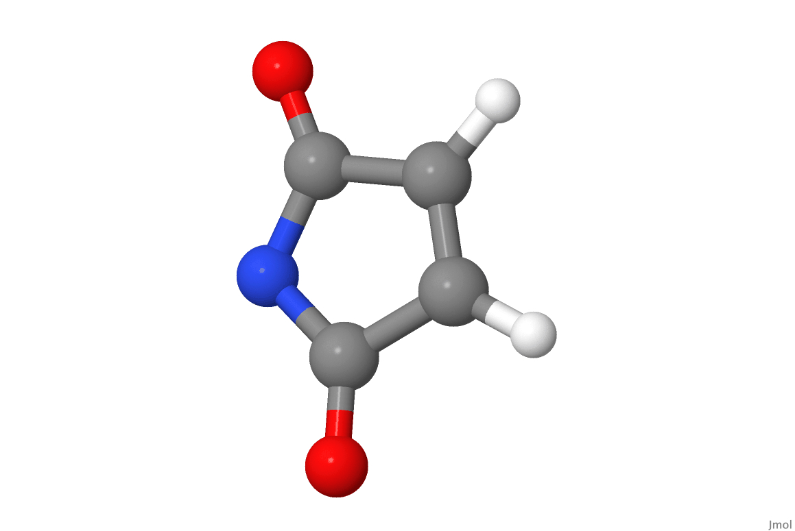
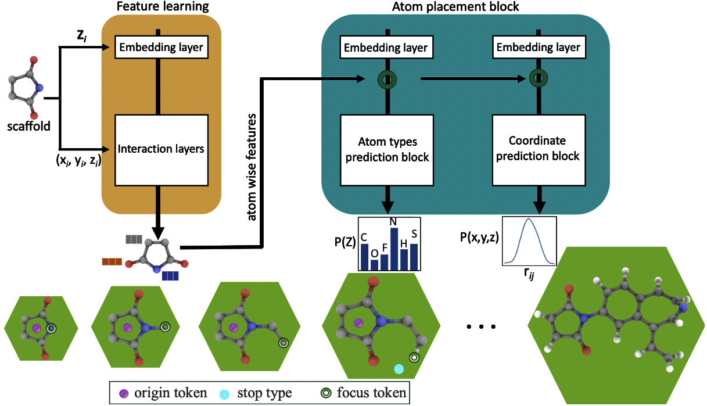

****3D-Scaffold: Deep Generative Framework to Generate 3D-ccordinates of Molecules with Desired Scaffolds.****

3D-Scaffold framework is built on top of GSchNet model[1].

3D-Scaffold generates entire molecules with desired scaffolds in an autoregressive fashion, placing one atom after another in 3d Euclidean space of scaffolds. It only uses
 the 3D positions and types of atoms in a molecule along with the SMILES string of scaffold as an input and generates novel therapeutic candidates as output.

**Requirements**

gschnet, 
schnetpack 0.3, 
pytorch >= 1.2, 
python >= 3.7,
ASE >= 3.17.0, 
Open Babel 2.41, 
rdkit >= 2019.03.4.0 

Please install dependencies and requirements for running the model from Reference 1.

**Generate a database;**

python generate_3D_Scaffold.py

Move the generated database file 'Scaffold3D.db' to ./data/ folder 

**Training a model;**
To train a model with same hyperparameters as described in paper;

python ./scaffold3D.py train 3D_Scaffold ./data/ ./model --split 2000 500 --cuda --batch_size 5 --draw_random_samples 5 --features 64 --interactions 6 --max_epochs 1000

**Generate a model;**

python ./scaffold3D.py generate 3D_Scaffold  ./model/ 100 --functional_group 'C=CC(=O)N' --chunk_size 100 --max_length 65 --file_name scaffold

**Filter the generated molecules;**

python filter_generated.py ./model/generated/scaffold.mol_dict

**Write generated molecules in to xyz file**

Python write_xyz.py

**References;**
1. Gebauer, N.; Gastegger, M.; Sch ̈utt, K. Symmetry-adapted generation of 3d point setsfor  the  targeted  discovery  of  molecules.  Advances  in  Neural  Information  ProcessingSystems. 2019; pp 7566–7578.
